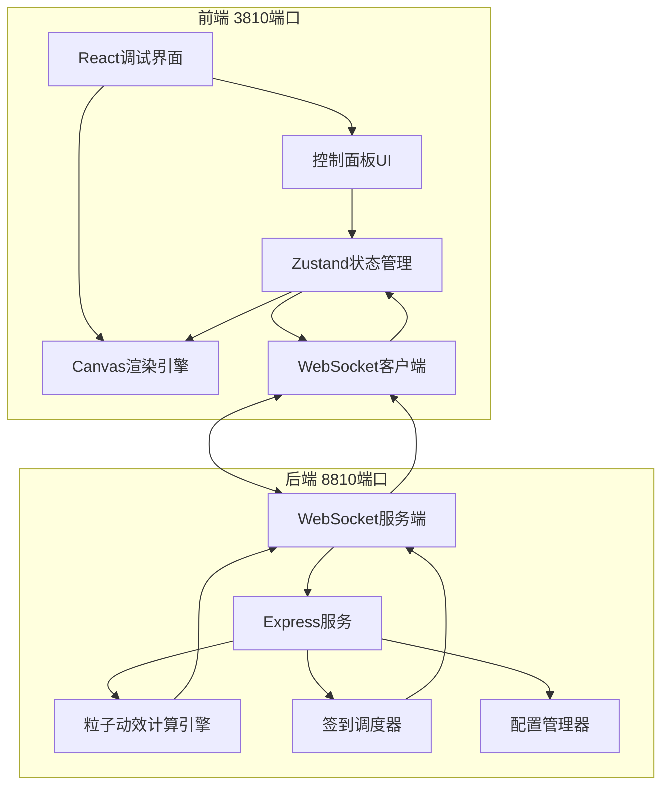
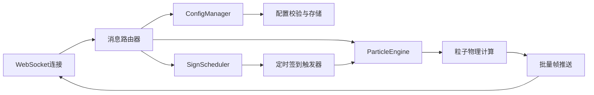

## 1. 架构设计



## 2. 技术说明

- **前端**：React@18 + TypeScript + Vite + TailwindCSS@3 + Zustand
- **后端**：Express@4 + TypeScript + WebSocket (ws)
- **渲染**：HTML5 Canvas 2D API（高性能粒子渲染）
- **通信**：WebSocket 实时双向通信（参数同步、粒子数据推送）
- **初始化工具**：vite-init（react-express-ts 模板）

## 3. 路由定义

| 路由 | 端口 | 用途 |
|------|------|------|
| / | 3810 | 调试主页 - 大屏展示+控制面板 |
| /health | 8810 | 后端健康检查 |
| /api/config | 8810 | 获取/更新动效配置（REST） |
| /api/sign | 8810 | 触发单次签到事件（REST） |
| /api/reset | 8810 | 重置签到墙状态（REST） |
| ws:// | 8810 | WebSocket 实时粒子数据流 |

## 4. API 定义

### 4.1 类型定义

```typescript
// 动效配置
interface EffectConfig {
  textSize: number;           // 签到文字大小 (12-72px)
  textDensity: number;        // 排列密度 (0.1-2.0)
  fallSpeed: number;          // 飘落速度 (0.5-5.0)
  gradientStart: string;      // 渐变起始色
  gradientEnd: string;        // 渐变结束色
  particleCount: number;      // 背景粒子数量 (0-500)
  particleSpeed: number;      // 粒子浮动速度 (0.1-3.0)
  layoutMode: 'spiral' | 'matrix' | 'random';  // 排列模式
  effects: {
    signatureFall: boolean;   // 签名飘落特效
    colorGradient: boolean;   // 色彩渐变特效
    particleFloat: boolean;   // 粒子浮动特效
    starfield: boolean;       // 背景星空特效
    glowBurst: boolean;       // 定格光爆特效
  };
}

// 签到数据
interface SignEvent {
  id: string;
  name: string;
  timestamp: number;
  targetX: number;
  targetY: number;
  color: string;
}

// 粒子状态
interface Particle {
  id: string;
  x: number;
  y: number;
  vx: number;
  vy: number;
  type: 'signature' | 'floating' | 'burst';
  text?: string;
  color: string;
  alpha: number;
  size: number;
  rotation: number;
  settled: boolean;
  life: number;
  maxLife: number;
}

// 运行时状态
interface RuntimeStats {
  fps: number;
  signCount: number;
  activeParticles: number;
  uptime: number;
}
```

### 4.2 WebSocket 消息协议

```typescript
// 客户端 → 服务端
type ClientMessage =
  | { type: 'config'; payload: Partial<EffectConfig> }
  | { type: 'sim:start'; payload: { interval: number; names?: string[] } }
  | { type: 'sim:stop' }
  | { type: 'sign'; payload: { name: string } }
  | { type: 'reset' }
  | { type: 'ping' };

// 服务端 → 客户端
type ServerMessage =
  | { type: 'config'; payload: EffectConfig }
  | { type: 'particle:update'; payload: Particle[] }
  | { type: 'sign:event'; payload: SignEvent }
  | { type: 'stats'; payload: RuntimeStats }
  | { type: 'reset:done' }
  | { type: 'pong' };
```

## 5. 服务端架构图



## 6. 数据模型

### 6.1 内存数据模型（无数据库，纯内存运行）

```
EffectConfig (单例)
  └─ 所有动效参数实时存储于内存

ParticlePool (Map<string, Particle>)
  └─ 活跃粒子集合，定期清理过期粒子

SignRecord[]
  └─ 签到记录数组，用于统计和重置
```

### 6.2 无持久化设计
本系统采用纯内存运行模式，不使用任何数据库或文件存储。所有状态在服务重启后重置，符合"全程无任何文件操作"的需求。
