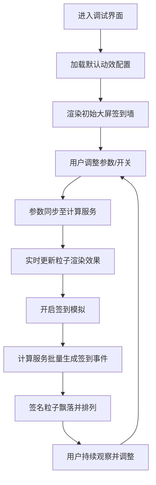

## 1. 产品概述

大屏签到墙粒子动效调试系统，用于可视化复刻线下大屏签到场景。系统提供线上交互预览调试能力，支持自定义签名飘落、色彩渐变、粒子浮动等动效参数，模拟多人连续签到完整流程。

- 核心价值：无需线下硬件部署，线上即可完整预览和调试大屏签到墙效果
- 目标用户：活动策划、视觉设计师、前端开发人员

## 2. 核心功能

### 2.1 用户角色
| 角色 | 注册方式 | 核心权限 |
|------|----------|----------|
| 调试用户 | 无需注册 | 配置动效参数、预览大屏效果、模拟签到流程 |

### 2.2 功能模块
1. **大屏签到墙展示区**：Canvas渲染签到粒子、签名飘落、色彩渐变效果
2. **动效参数控制面板**：签名文字大小、排列密度、色彩渐变、粒子浮动等配置
3. **粒子特效开关**：独立控制各类粒子特效的启用/禁用
4. **签到模拟控制器**：循环模拟多人连续签到，控制签到频率、人数
5. **实时状态面板**：显示当前签到人数、粒子数量、FPS等运行指标

### 2.3 页面详情
| 页面名称 | 模块名称 | 功能描述 |
|----------|----------|----------|
| 调试主页 | 大屏展示区 | 全屏Canvas渲染签到墙效果，签名文字从顶部飘落并最终定格排列 |
| 调试主页 | 参数控制面板 | 滑块/输入框配置文字大小、密度、颜色渐变起始/结束色、粒子速度等 |
| 调试主页 | 特效开关组 | 签名飘落开关、色彩渐变开关、粒子浮动开关、背景星空开关 |
| 调试主页 | 签到模拟器 | 自动/手动切换、签到频率调节、重置功能、模拟人数显示 |
| 调试主页 | 状态栏 | 实时FPS、签到人数统计、活跃粒子数 |

## 3. 核心流程

用户进入调试界面 → 配置动效参数 → 开启签到模拟 → 观看大屏签到墙效果 → 实时调整参数 → 观察效果变化 → 循环重复直至满意

## 4. 用户界面设计

### 4.1 设计风格
- **主色调**：深空蓝 `#0a0e27` 作为背景基调，搭配霓虹青 `#00f0ff`、霓虹粉 `#ff00aa` 双渐变高光
- **辅色调**：紫色 `#8a2be2`、金色 `#ffd700` 作为强调色
- **按钮风格**：半透明玻璃拟态，圆角 8px，带发光边框 hover 效果
- **字体**：展示字体使用 Orbitron（科技感），控制面板使用 JetBrains Mono（等宽可读）
- **布局风格**：左侧大屏主展示区（占比 75%），右侧控制面板抽屉式（占比 25%，可折叠）
- **视觉元素**：发光文字、粒子辉光、扫描线、网格背景、毛玻璃面板

### 4.2 页面设计概览
| 页面名称 | 模块名称 | UI元素 |
|----------|----------|--------|
| 调试主页 | 大屏展示区 | Canvas全屏渲染、发光签名文字、渐变粒子、星空背景、扫描线叠加 |
| 调试主页 | 控制面板 | 毛玻璃侧边栏、滑块控件、色板选择器、Toggle开关、数值输入框 |
| 调试主页 | 状态栏 | 底部悬浮条、实时数据指标、脉冲发光指示器 |

### 4.3 响应式
- 桌面端优先，支持 1920×1080 及以上分辨率大屏展示
- 控制面板可折叠，大屏展示区自适应全屏
- 触控设备支持基础操作

### 4.4 动效设计指引
- 签名飘落：从顶部随机位置以不同速度飘落，带轻微旋转和摇摆
- 色彩渐变：签名颜色在霓虹青→霓虹粉→紫色之间平滑过渡
- 粒子浮动：背景粒子缓慢漂浮，碰撞时产生微小光爆
- 签到定格：签名飘落至目标位置时产生发光扩散特效后定格
- 文字排列：按照螺旋/矩阵/随机三种模式在大屏上自动排列
